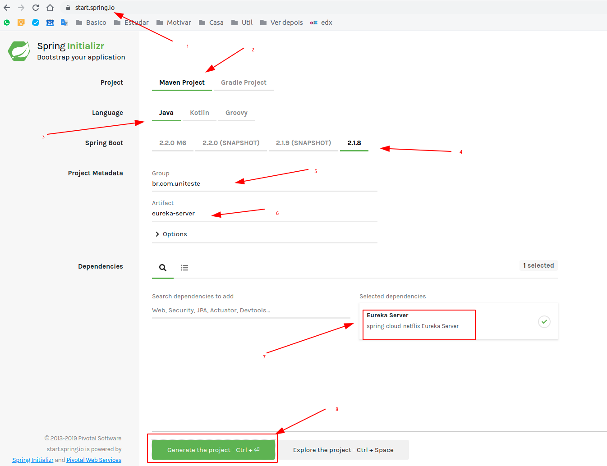
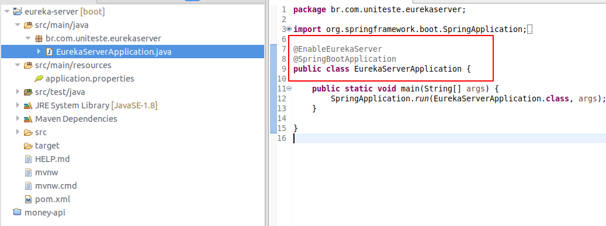
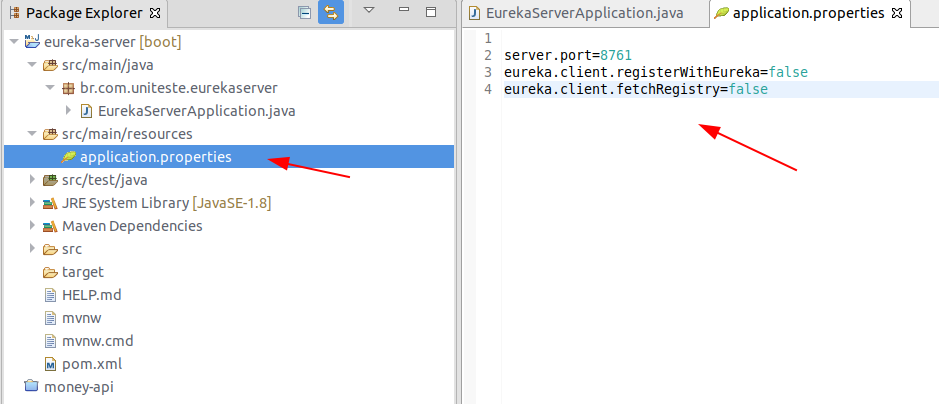

01 - Spring Cloud Netflix Eureka

### o que é 


https://coderef.com.br/arquitetura-de-microservices-com-spring-cloud-e-spring-boot-parte-3-b84b3dce13a0


#### Para criar um Eureka server

1. **Baixe um projeto do https://start.spring.io/**



ou adicione no pom 

```xml
<dependency>
    <groupId>org.springframework.cloud</groupId>
    <artifactId>spring-cloud-starter-netflix-eureka-server</artifactId>
</dependency>
 
<dependencyManagement>
    <dependencies>
        <dependency>
            <groupId>org.springframework.cloud</groupId>
            <artifactId>spring-cloud-starter-parent</artifactId>
            <version>Greenwich.RELEASE</version>
            <type>pom</type>
            <scope>import</scope>
        </dependency>
    </dependencies>
</dependencyManagement>
```

2.  importe com o eclipse
3. Adicione a anotação na classe de aplicação

```java
@EnableEurekaServer
@SpringBootApplication
public class EurekaServerApplication {
    public static void main(String[] args) {
        SpringApplication.run(EurekaServerApplication.class, args);
    }
}
```




4. add as propriedades no arquivo `application.properties`

```
server.port=8761
eureka.client.registerWithEureka=false
eureka.client.fetchRegistry=false
```



